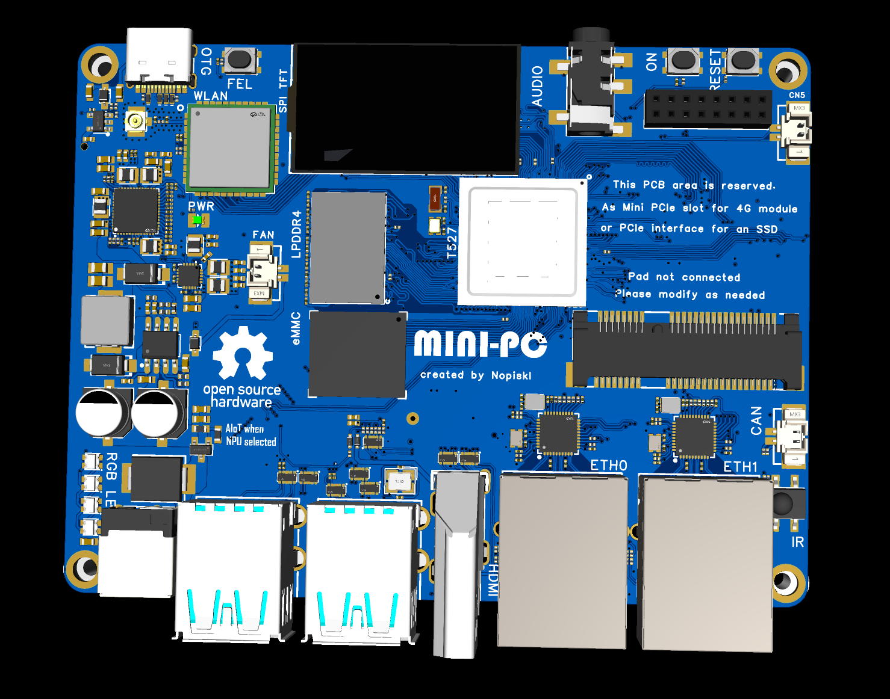
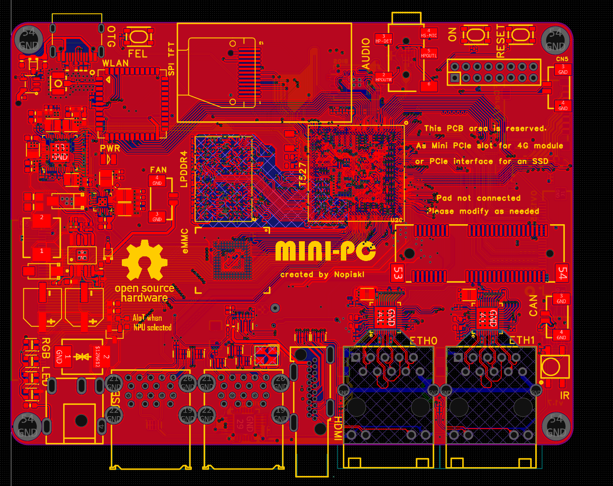

# T527 MicroPC

T527 MicroPC 是一款基于全志 T527 平台设计的 MicroPC / IIoT 开发板项目，采用 8 层高速 PCB 设计，面向嵌入式 Linux、工业网关、机器人控制、边缘 AI 控制上位机等应用场景。

项目提供硬件设计资料、系统适配说明与 SDK / Bootloader 适配入口，可作为 T527 平台的二次开发、系统移植和产品原型验证参考。

<p align="center">
  
  
</p>

## 项目特点

- 基于全志 T527 SoC，适用于高性能嵌入式 Linux 与 IIoT 场景。
- 8 层高速 PCB 设计，兼顾信号完整性、接口扩展与工程可制造性。
- 支持 Avaota A1 镜像生态，可适配 Mainline Linux、Ubuntu CLI、Armbian、OpenWrt 等系统。
- 可用于 OpenWrt 工业网关、ROS 机器人系统、边缘 AI 控制上位机、工业采集与控制终端等方向。
- 提供硬件生产资料、原理图、3D 结构文件与系统适配目录，方便快速评估和二次开发。
- 已完成与 Linux_BSP 项目联动，便于统一维护 T527 BSP 与板级适配内容。

## 目录结构

```text
T527_MicroPC/
├── Hardware/
│   ├── 3D.png
│   ├── PCB.png
│   ├── 3D_PCB1_3_2026-06-18.step
│   ├── Gerber_PCB1_3_2026-06-18.zip
│   ├── ProPrj_T527 MicroPC_2026-06-18.epro2
│   └── SCH_T527 MicroPC_2026-06-18.pdf
├── SDK/
│   ├── AvaotaOS
│   ├── TinaAIOT_SDK
│   └── SyterKit
└── README.md
```

## 硬件资料

`Hardware` 目录包含 T527 MicroPC 的硬件设计与生产相关文件：

- `SCH_T527 MicroPC_2026-06-18.pdf`：原理图文件。
- `Gerber_PCB1_3_2026-06-18.zip`：PCB 生产 Gerber 文件。
- `3D_PCB1_3_2026-06-18.step`：结构 3D STEP 文件。
- `ProPrj_T527 MicroPC_2026-06-18.epro2`：EDA 工程源文件。
- `3D.png` / `PCB.png`：板卡 3D 预览图与 PCB 预览图。

## 软件与系统适配

`SDK` 目录用于放置与 T527 MicroPC 相关的软件适配内容：

- `SDK/AvaotaOS`：AvaotaOS 系统适配入口。
- `SDK/TinaAIOT_SDK`：Tina AIoT SDK 适配入口。
- `SDK/SyterKit`：Bootloader / SyterKit 适配入口。

当前项目目标是围绕 T527 MicroPC 提供从硬件到系统启动链路的完整参考，包括板级配置、镜像适配、引导程序适配和 BSP 联动维护。

## 相关项目

- [BSP_T527 / Linux_BSP](https://github.com/Nopiskl/Linux_BSP)：T527 相关 BSP、内核、设备树与板级系统适配项目。
- [AvaotaOS-main / AvaotaOS](https://github.com/AvaotaSBC/AvaotaOS)：AvaotaOS 主线系统项目，可用于 T527 MicroPC 的系统镜像与软件生态适配。

## 典型应用

- OpenWrt 多网口网关或工业网络终端。
- Ubuntu CLI / Armbian 嵌入式开发环境。
- ROS 机器人控制与传感器数据处理平台。
- 边缘 AI 推理控制、视觉采集和设备管理上位机。
- IIoT 数据采集、协议转换和现场控制节点。

## 当前状态

- 硬件设计资料已整理。
- 原理图、Gerber、STEP 与 PCB 预览资料已提供。
- AvaotaOS、TinaAIOT SDK 与 SyterKit 适配目录已规划。
- 已与 BSP_T527 / Linux_BSP 项目建立联动，后续适配内容将围绕 BSP 与系统镜像持续更新。
